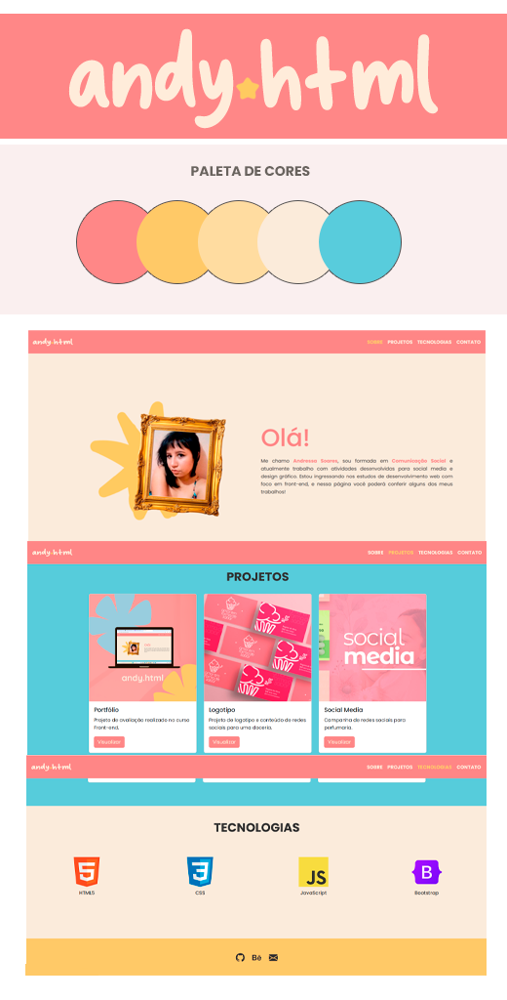

# avaliacaoportfolio
Avaliação: HTML, CSS e Bootstrap.

Olá! Este é um projeto desenvolvido no Amontada Valley para o curso Front-end.

O objetivo do trabalho consistiu em utilizar as tecnologias HTML, CSS e Bootstrap para criar uma página de portfólio onde pudéssemos exibir nossas habilidades adquiridas no curso e falar um pouco sobre possíveis projetos ou trabalhos criados anteriormente.

Abaixo você poderá visualizar algumas capturas de tela da página criada.

O portfólio foi dividido nas seções: Sobre, Trabalhos, Tecnologias e Contato. Bem autoexplicativas, em cada seção, respectivamente, faço uma breve apresentação sobre minha formação e a natureza do meu trabalho, mostro projetos já realizados em uma seção de cards com os links para cada projeto, incluindo este. Nas seções seguintes adicionei algumas das tecnologias que estamos aprendendo no curso e, em seguida, os links de contato.

